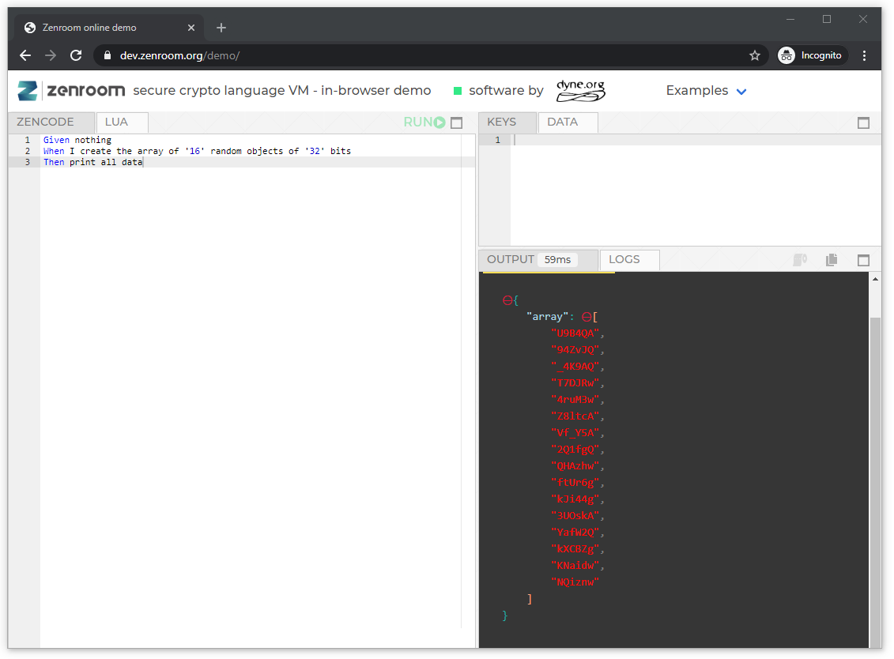
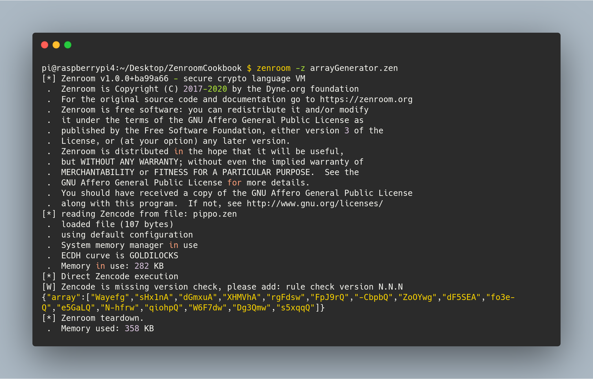

<!-- Unused files
 
givenDebugOutputVerbose.json
givenLongOutput.json
 

Link file with relative path downloadable: 
<a href="./_media/examples/zencode_cookbook/thenExhaustiveScript.zen" download>thenExhaustiveScript.zen</a>
 
-->


# The ***Then*** phase: processing the output

In the ***Then*** phase, the output is shaped, processed, sorted and printed out. This is where you can decide what output you want to see and if you want to encode your data into something else. 

# The basics

Let's see two basic examples, where let's say that we are loading this object: 

```json
{
"myNumber":123456789 }
```

In the first example, we'll simply print an object *as it is*, meaning using the default encoding of its ***schema*** or the encoding defined in a ***rule output encode*** statement (if present), along with the default file format (JSON): 

```gherkin
Then print the 'myNumber' 
```

The output should simply be *123456789*.

In the second example, we wanna spice things up a bit and print the number as something else (with a different encoding), lets say as an *hex*:

```gherkin
Then print the 'myNumber' as 'hex'
```

The output here will be the *hex* value of *123456789*, which is *75BCD15*

You can also print with a different encoding an object that, at the output, is nested into something else, which is often the case when you are using ***schemas*** for example if you have:

```json
{
"petition": {"uid" : "TW9yZV9wcml2YWN5X2Zvcl9hbGwh"} }
```

You may want to print the *uid* as string, instead of the default base64 encoding. You can do this by: 

```gherkin
Then print the 'uid' from 'petition' as 'string'
```

And the output shoul be:

```json
{
"uid": "More_privacy_for_all!" }
```


## Printing nested objects

When working with ***dictionaries*** or ***schemas*** you may want to print out just a part of the data you're working with. The statement that comes to help here is: 

```gherkin
Then print the 'childObject' inside 'parentObject'
```

Here are a couple examples, keep in mind that **in** and **inside** are interchangeable:

[](../_media/examples/zencode_cookbook/thenCompleteScriptPart4.zen ':include :type=code gherkin')

The output should look like this:

[](../_media/examples/zencode_cookbook/thenCompleteOutputPart4.json ':include :type=code json')


## The ***my*** and ***all*** operators

We have already learned how the ***my*** operator works to load data in the ***Given*** phase.

In a similar fashion, we can selectively print out only the data loaded using the ***Given I am*** and ***Given I have my ...*** statements, but using the statement:

```gherkin
Then print my data
```

In the same fashion, you can print all the data using the statement

```gherkin
Then print all data
```

<!-- template 

## Sorting data output

We've learned that when using the ***Then print all data*** or ***Then print my data*** statements, Zenroom will automatically sort the output alphabetically, because *Determinism is King*. 

In case you need to have your output sorted differently, you can do this by explicitly printing every data object in the order you need. Assuming to have three strings, whose content match their name, we could for example need and inverse sorting, which we would achieve doing  something like: 

```gherkin
Then print 'C-String' 
Then print 'B-String' 
Then print 'A-String' 
```
-->

## Overwriting values

As in the ***When*** phase, if you print multiple times the same object with a different encoding (or different file format), the only output that will see will be the last one in the script. So for example by doing:

```gherkin
Then print 'myNumber' 
And print 'myNumber' as 'hex'
```

The output will be *75BCD15*.

# Printing text 

By now we have mastered the ***Then print*** statement, by stating the name of the object to be printed out.
What happens if the object doesn't exist? Zenroom would simply print the name of the object or, if you prefer, it would print whatever you enclose in the single quotes. For example the line:

```gherkin
Then print 'This variable does not exist anywhere!' 
```

Would print out: 

```JSON
"This_variable_does_not_exist_anywhere!" 
```


# Comprehensive list of *Then* statements

In the large script <a href="./_media/examples/zencode_cookbook/thenExhaustiveScript.zen" download>thenExhaustiveScript.zen</a> you can find a comprehensive list of most of the combinations you'll ever need to print out the output of Zenroom, that you can test using the JSON <a href="./_media/examples/zencode_cookbook/myLargeNestedObjectThen.json" download>myLargeNestedObjectThen.json</a>. Your output should look like this: <a href="./_media/examples/zencode_cookbook/thenExhaustiveScriptOutput.json" download>thenExhaustiveScriptOutput.json</a> 

# The script used to create the material in this page

All the smart contracts and the data you see in this page are generated by the script [run-then.sh](https://github.com/dyne/Zenroom/blob/master/test/zencode_cookbook/run-then.sh). If you want to run the script (on Linux) you should: 
 - *git clone https://github.com/dyne/Zenroom.git*
 - install **zsh** and **jq**
 - download a [zenroom binary](https://zenroom.org/#downloads) and place it */bin* or */usr/bin* or in *./Zenroom/src*


<!-- template 


One of Zenroom's strong points is the quality of the random generation (see [random test 1](https://github.com/DECODEproject/Zenroom/blob/master/test/random_hamming_gnuplot.sh) and [random test 2](https://github.com/DECODEproject/Zenroom/blob/master/test/random_rngtest_fips140-2.sh)), which happens to pass NIST's [tests](https://github.com/DECODEproject/Zenroom/blob/master/test/nist/run.sh), so let's start with generate an array of random numbers and get it printed out. 

Let's first go the super fast way to test code, entering the [Zenroom web demo](https://dev.zenroom.org/demo/). Copy this code into the *Zencode* tab on the top left of the page: 


[](../_media/examples/zencode_cookbook/randomArrayGeneration.zen ':include :type=code gherkin')


Then press the *RUN▶️* button to execute the script, the result should look like this:



We got a nice array here. You can play with the values *'16'* and *'32'*, to see both the array and the random numbers change their length. 

# Saving the output 

Once you're done with your array, it's time to go pro, meaning that we're leaving the web demo and moving to using Zenroom as *command line application* (CLI). 

 - The first step is to download a version of Zenroom that works on your system from the [Zenroom downloads](https://zenroom.org/#downloads). 
 - If you're using Linux, you'll want to place Zenroom in `/bin` or `/usr/sbin` (or just creat a simlink or an alias).
 - Third, fire up your favourite text editor, paste the smart contract in it and save it *arrayGenerator.zen*

Now you can let zenroom execute the script by launching the command:

```
zenroom -z arrayGenerator.zen 
```

The result will look like this: 



In the example Zenroom did graciously output first the licensing, then some information about the file and the execution setting, a warning, our array and finally a message stating the it correctly shutdown after using a certain amount of RAM...a lot of information: how do I get my array saved into a file that I can later use? 

On Linux, you can use: 

```bash
zenroom -z arrayGenerator.zen | tee myArrays.json
```

After running this command, a file named *myArrays.json* should have magically appeared in the folder you're in.

# Renaming the array: the *And* keyword

Open *myArray.json* with your text editor, and notice that the array produced with our first script is named "array": that is Zenroom's behaviour when creating objects. But what if that array should be called something else? First you will need to learn two concepts: 
 - All data manipulation has to occur in the *When* phase.
 - Each phase can have as many commands as you like, provided that they're on a different line and they begin with the keyword *And* 
For example, you can rename your array to *'myArray'* by running this script:

[](../_media/examples/zencode_cookbook/randomArrayRename.zen ':include :type=code gherkin')

Note that you need to use the **' '** in the line that renames the array, cause you may be generating and renaming a bunch of arrays already, like in this script:

[](../_media/examples/zencode_cookbook/randomArrayMultiple.zen ':include :type=code gherkin')


The script above will produce an output like this:


[](../_media/examples/zencode_cookbook/myArrays.json ':include :type=code json')


Certainly, at this point, your keen eye has noted something odd in the output...If in the Zencode I generated the arrays sorted by size, why is output sorted differently? Because in Zenroom, my friend,  [Determinism](https://github.com/DECODEproject/Zenroom/blob/master/test/deterministic_random_test.sh) is king, so Zenroom will by default sort the output alphabetically.


-->